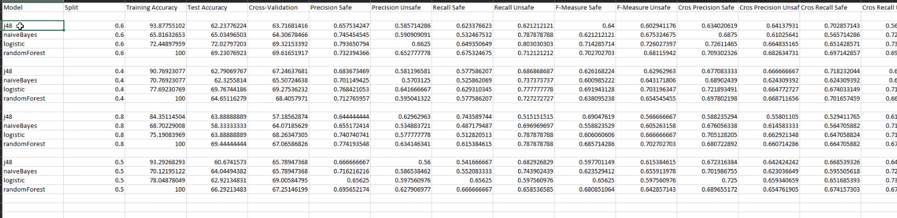

# CPS DevOps

## Meeting with Bill on 5.11.20

- BeamNG is only required to provide an oracle, e.g. when generating and evaluating scenarios on the fly

    ```cps_sorter real-time-eval```

- BeamNG is not required if previously evaluated scenarios are provided

    ```cps_sorter run-model-eval -i /path/to/test/scenarios```

eval results:



- We need to adjust the model training to get classification of unsafe/safe (since not provided in results)
    ''' @CPS-Sorter/src/cps-sorter/services/cli.py
- required: weka_helper.py
- wekahelper - make_bulk_predictions
- wekahelper.build_modules
- use training file "?0.4-06-split-datasetname.csv?" for training file


## Next Steps
- current no SSH connection to server
- install CPS on Server
- refactor ML pipeline
- setup Jenkins pipeline
